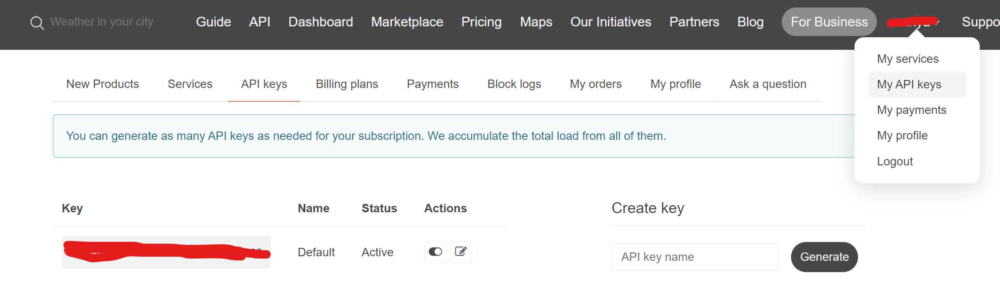

# Weather App

## Описание

Веб-приложение позволяет получить погоду в любом городе мира. Также оно отображает локальное время и дату в городе, в котором смотрят погоду. 

## Локальный запуск
Перед запуском сервера создать файл `.env` с переменными окрежения. Там нужно создать переменную `WEATHER_API` и в нее положить API-ключ. Файл `.env` нужно создавать в `weather_app/weather_app/.env`.

Чтобы получить API-ключ нужно зарегестрироваться [на сайте API](https://openweathermap.org/api), через которую мы получаем погоду. После регестрации нужно нажать на свой логин, далее на My API keys, а затем скопировать ключ из поля Key.



Вставляем это значение в значение переменной `WEATHER_API` в `.env`. Теперь можно устанавливать зависимости.


### Устанавливаем зависмости
#### pip
```bash
python -m venv venv
. venv/bin/activate
pip install -r requirements.txt
```

#### poetry
```bash
poetry 
```

### poetry


